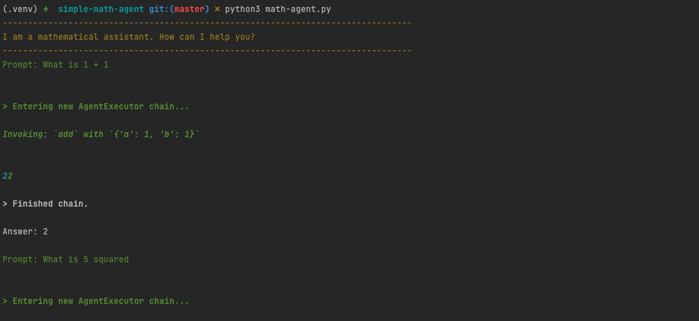

# A Simple Math Agent with LangChain

## Summary
This script is a simple math agent to help you get started with using Agents in LangChain

An Agent in LangChain requires Tools, which are combined into a Toolkit and passed to the Agent.

Here we create our own simple and custom "add", "multiply", and "square" tools, and pass them in to our agent
in order to create a simple Mathematics agent.

I wrote an article which explores some of the basic concepts around Agents here, as well as walks through how
to build out the below script

## Getting started
Clone the repository, set up the virtual environment, and install the required packages

```
git clone git@github.com:smaameri/simple-math-agent.git
cd simple-math-agent
python3 -m venv .venv
. .venv/bin/activate
pip install -r requirements.txt
```

## Store your OpenAI API key
Copy the example env file

`cp .env.example .env`

Now copy your OpenAI API key into the `.env` file, and save the file. It should send up looking something like

`OPENAI_API_KEY=sk-`

## Start interacting with the agent
Kick of the agent chatbot, and start asking it your most challenging mathematical ponderances. Not really, keep it simple,
remember this is a simple agent 🙂

Press Ctrl + C to exit the chat window at any time.

```python
python3 math-agent.py
```

